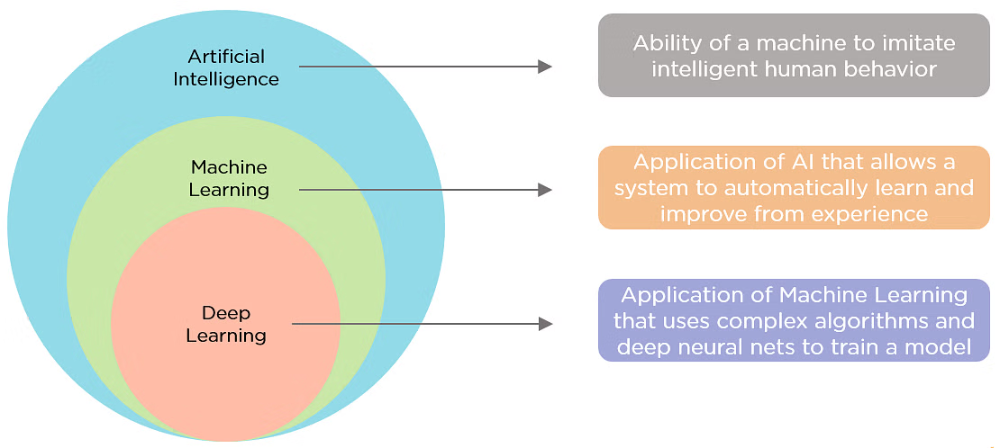

# Intelligence artificielle : c'est quoi ?

> "The science and engineering of making intelligent machines, especially intelligent computer programs."    - **John McCarthy**

Cette définition met l'accent sur la création de systèmes capables de simuler une intelligence de type humain, ce qui inclut le raisonnement, la résolution de problèmes, l'apprentissage et la perception. 

## Comprendre la différence entre AI vs Machine Learning vs Deep Learning vs Data Science

**Intelligence Artificielle (IA)** : L'objectif principal de l'IA est de créer des systèmes capables d'imiter l'intelligence humaine, de résoudre des problèmes complexes, et de prendre des décisions automatiquement. L'IA se concentre sur l'automatisation des tâches intelligentes et la création de systèmes autonomes.

**Data Science** : La Data Science se concentre sur l'analyse des données, l'extraction d'informations précieuses, et la découverte d'insights pour la prise de décision en utilisant des techniques statistiques. L'objectif est de comprendre les tendances et de tirer des conclusions exploitables à partir des données.

## Advantages

- **L'excellence dans les tâches axés sur le détail** :  L'IA convient bien aux tâches qui impliquent l'identification de modèles et de relations subtiles dans les données qui pourraient être négligées par les humains. Par exemple, en oncologie, les systèmes d'IA ont fait preuve d'une grande précision dans la détection des cancers à un stade précoce, tels que le cancer du sein et le mélanome, en mettant en évidence les zones préoccupantes pour une évaluation plus approfondie par les professionnels de la santé. Exemple : [MIA](https://www.kheironmed.com/mammography/)

- **Efficacité dans les tâches nécessitant beaucoup de données** : Les systèmes d'IA et les outils d'automatisation réduisent considérablement le temps nécessaire au traitement des données. Cela est particulièrement utile dans des secteurs tels que la finance, l'assurance et la santé, qui impliquent une grande quantité de saisie et d'analyse de données de routine, ainsi que des prises de décision fondées sur des données. Par exemple, dans la banque et la finance, les modèles prédictifs d'IA peuvent traiter de vastes volumes de données pour prévoir les tendances du marché et analyser le risque d'investissement.

- **Gains de temps et de productivité** : L'IA et la robotique peuvent non seulement automatiser les opérations, mais aussi améliorer la sécurité et l'efficacité. Dans l'industrie manufacturière, par exemple, les robots alimentés par l'IA sont de plus en plus utilisés pour effectuer des tâches dangereuses ou répétitives dans le cadre de l'automatisation des entrepôts, réduisant ainsi le risque pour les travailleurs humains et augmentant la productivité globale.

- **Adaptation et personnalisation** : Les systèmes d'IA peuvent améliorer l'expérience des utilisateurs en personnalisant les interactions et la fourniture de contenu sur les plateformes numériques. Sur les plateformes de commerce électronique, par exemple, les modèles d'IA analysent le comportement des utilisateurs pour leur recommander des produits adaptés à leurs préférences, ce qui accroît la satisfaction et l'engagement des clients.
    
- **Disponibilité permanente** : Les programmes d'IA n'ont pas besoin de dormir ou de faire des pauses. Par exemple, les assistants virtuels alimentés par l'IA peuvent fournir un service client ininterrompu, 24 heures sur 24 et 7 jours sur 7, même en cas de volumes d'interaction élevés, ce qui améliore les temps de réponse et réduit les coûts.

- **Évolutivité** : Les systèmes d'IA peuvent évoluer pour gérer des quantités croissantes de travail et de données. L'IA est donc bien adaptée aux scénarios dans lesquels les volumes de données et les charges de travail peuvent croître de manière exponentielle, comme la recherche sur internet et l'analyse commerciale.

- **Accélération de la recherche et du développement** : L'IA peut accélérer le rythme de la R&D dans des domaines tels que les produits pharmaceutiques et la science des matériaux. En simulant et en analysant rapidement de nombreux scénarios possibles, les modèles d'IA peuvent aider les chercheurs à découvrir de nouveaux médicaments, matériaux ou composés plus rapidement que les méthodes traditionnelles. Exemple [Alphafold 3](https://deepmind.google/technologies/alphafold/)

- **Durabilité et conservation** : L'IA et l'apprentissage automatique sont de plus en plus utilisés pour surveiller les changements environnementaux, prédire les événements météorologiques futurs et gérer les efforts de conservation. Les modèles d'apprentissage automatique peuvent traiter des images satellites et des données de capteurs pour suivre les risques d'incendie de forêt, les niveaux de pollution et les populations d'espèces menacées, par exemple.

- **Optimisation des processus** : L'IA est utilisée pour rationaliser et automatiser des processus complexes dans diverses industries. Par exemple, les modèles d'IA peuvent identifier les inefficacités et prédire les goulets d'étranglement dans les processus de fabrication, tandis que dans le secteur de l'énergie, ils peuvent prévoir la demande d'électricité et répartir l'offre en temps réel.

## Disadvantages

- **Coûts élevés** : Le développement de l'IA peut être très coûteux. L'élaboration d'un modèle d'IA nécessite un investissement initial substantiel dans l'infrastructure, les ressources informatiques et les logiciels pour former le modèle et stocker ses données de formation. Après la formation initiale, il y a d'autres coûts permanents associés à l'inférence et au recyclage du modèle. Sam Altman, PDG d'OpenAI, a déclaré que la formation du modèle GPT-4 de l'entreprise avait coûté plus de 100 millions de dollars. Vu la vitesse de l'avancement et le besoin, les entreprises comme Google, Open AI en partenariat avec Microsoft contruisent des centres nucléaires pour répondre aux besoins électriques de leurs datacentres. Seul Elon Musk a déjà construit un datacentre pour GrokAI à large échelle. 
- **Complexité technique** : Le développement, l'exploitation et le dépannage des systèmes d'IA - en particulier dans des environnements de production réels - nécessitent un savoir-faire technique important. Dans de nombreux cas, ces connaissances diffèrent de celles nécessaires à la création de logiciels non liés à l'IA. Par exemple, la création et le déploiement d'une application d'apprentissage automatique impliquent un processus complexe, en plusieurs étapes et très technique, allant de la préparation des données à la sélection des algorithmes, en passant par le réglage des paramètres et le test des modèles.
- **Biais algorithmique** : Les algorithmes d'IA et d'apprentissage automatique reflètent les biais présents dans leurs données d'apprentissage - et lorsque les systèmes d'IA sont déployés à grande échelle, les biais s'étendent également. Dans certains cas, les systèmes d'IA peuvent même amplifier des biais subtils dans leurs données d'apprentissage en les encodant dans des modèles renforçables et pseudo-objectifs. Dans un exemple bien connu, Amazon a mis au point un outil de recrutement piloté par l'IA pour automatiser le processus d'embauche, qui a favorisé par inadvertance les candidats masculins, reflétant ainsi les déséquilibres entre les sexes à plus grande échelle dans l'industrie technologique. EN autre exemple sera l'évaluation des candidats pour l'admission en première année à l'université de Texas. **(Ref Star Wars : You have become the very thing you swore to destroy!)**
- **Difficulté de généralisation** : Les modèles d'IA excellent souvent dans les tâches spécifiques pour lesquelles ils ont été formés, mais éprouvent des difficultés lorsqu'on leur demande d'aborder des scénarios nouveaux. Ce manque de flexibilité peut limiter l'utilité de l'IA, car de nouvelles tâches peuvent nécessiter le développement d'un modèle entièrement nouveau. Un modèle NLP formé sur un texte en anglais, par exemple, risque d'être peu performant sur un texte dans d'autres langues sans une formation complémentaire approfondie. Bien que des travaux soient en cours pour améliorer la capacité de généralisation des modèles - ce que l'on appelle l'adaptation au domaine ou l'apprentissage par transfert **(On verra ça plus en détail plutard dans le cours)** - cela reste un problème de recherche ouvert.
- **Déplacement d'emplois** : L'IA peut entraîner des pertes d'emploi si les organisations remplacent les travailleurs humains par des machines - un sujet de préoccupation croissant à mesure que les capacités des modèles d'IA deviennent plus sophistiquées et que les entreprises cherchent de plus en plus à automatiser les flux de travail à l'aide de l'IA. Par exemple, certains rédacteurs ont déclaré avoir été remplacés par de grands modèles linguistiques (LLM) tels que ChatGPT. Si l'adoption généralisée de l'IA peut également créer de nouvelles catégories d'emplois, celles-ci peuvent ne pas recouper les emplois supprimés, ce qui soulève des préoccupations en matière d'inégalité économique et de requalification.
- **Vulnérabilités en matière de sécurité** : Les systèmes d'IA sont sensibles à un large éventail de cybermenaces, notamment l'empoisonnement des données et l'apprentissage automatique antagoniste. Les pirates peuvent extraire des données d'entraînement sensibles d'un modèle d'IA, par exemple, inciter les systèmes d'IA à produire des résultats incorrects et nuisibles. Cette situation est particulièrement préoccupante dans les secteurs sensibles à la sécurité, tels que les services financiers et les administrations publiques.
- **Impact environnemental** : Les centres de données et les infrastructures de réseau qui sous-tendent les opérations des modèles d'IA consomment de grandes quantités d'énergie et d'eau. Par conséquent, l'entraînement et le fonctionnement des modèles d'IA ont un impact significatif sur le climat. L'empreinte carbone de l'IA est particulièrement préoccupante pour les grands modèles génératifs, qui nécessitent une grande quantité de ressources informatiques pour l'entraînement et l'utilisation continue.
- **Questions juridiques** : L'IA soulève des questions complexes en matière de protection de la vie privée et de responsabilité juridique, en particulier dans un contexte de réglementation de l'IA en constante évolution qui diffère d'une région à l'autre. L'utilisation de l'IA pour analyser et prendre des décisions basées sur des données personnelles a de sérieuses implications en matière de protection de la vie privée, par exemple, et la manière dont les tribunaux considéreront la paternité des documents générés par des LLM formés sur des œuvres protégées par le droit d'auteur n'est pas encore claire.

## Super AI vs General AI vs Narrow AI 

**Narrow AI** : Cette forme d'IA fait référence à des modèles formés pour effectuer des tâches spécifiques. Narrow AI fonctionne dans le contexte des tâches pour lesquelles elle est programmée, sans capacité de généralisation ou d'apprentissage au-delà de sa programmation initiale. Les assistants virtuels, tels que Siri d'Apple et Alexa d'Amazon, et les moteurs de recommandation, tels que ceux que l'on trouve sur les plateformes de streaming comme Spotify et Netflix, sont des exemples de Narrow AI.

**General AI** :  Ce type d'IA, qui n'existe pas encore, est plus souvent appelé intelligence générale artificielle (AGI). Si elle était créée, l'IAG serait capable d'effectuer toutes les tâches intellectuelles qu'un être humain peut accomplir. Pour ce faire, l'IAG devrait être capable d'appliquer un raisonnement dans un large éventail de domaines afin de comprendre des problèmes complexes pour lesquels elle n'a pas été spécifiquement programmée. Pour ce faire, elle aurait besoin de ce que l'on appelle la logique floue: une approche qui tient compte des zones grises et des gradations d'incertitude, plutôt que des résultats binaires, en noir et blanc.

**Super AI** : Ce type d'IA n'existe pas encore. L'ASI est une intelligence artificielle beaucoup plus avancée et puissante que le cerveau humain, capable d'exécuter n'importe quelle tâche cognitive de manière beaucoup plus efficace que les humains.Imaginez une ASI capable de faire des découvertes scientifiques révolutionnaires en quelques minutes, comme trouver un remède pour toutes les maladies, concevoir de nouvelles technologies avancées en un instant, ou résoudre des problèmes mondiaux complexes comme le changement climatique en trouvant des solutions innovantes que l'humanité n'aurait jamais pu envisager.

Donc la différence est Narrow AI (Effectuer une tâche comme les humains) vs General AI (Utiliser la connaissance et raisonner sur des tâches non matriser) vs Super AI (produire des nouvelles connaissance : La recherche par exemple)

