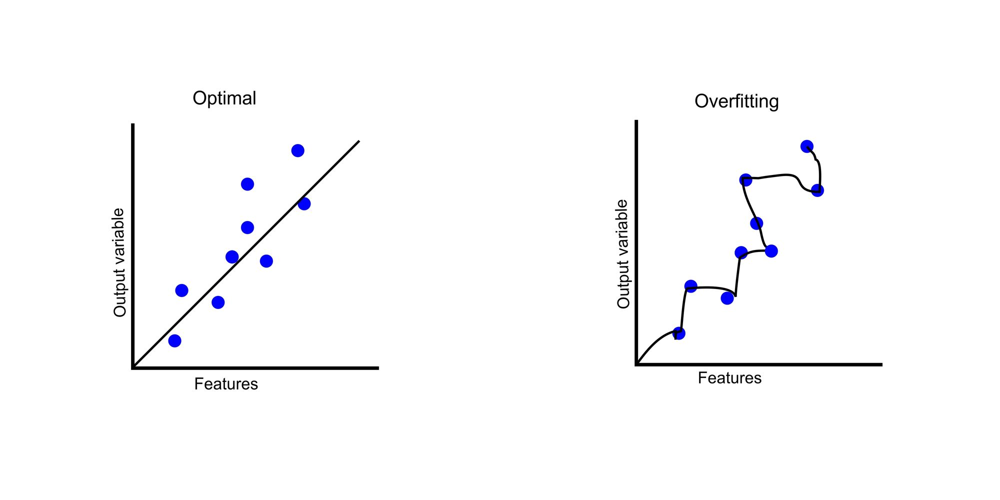

# Préparation des données

## Pourquoi le pre-traitement des données est-t-elle importante ? 

Cette expression signifie que si vous introduisez des données de mauvaise qualité ("garbage") dans un modèle de Machine Learning, vous obtiendrez des résultats de mauvaise qualité ("garbage out"). Même les algorithmes les plus avancés ne peuvent pas compenser des données mal préparées ou incorrectes.

Le prétraitement des données consiste à nettoyer, normaliser, transformer, et structurer les données pour les rendre utilisables par les algorithmes de Machine Learning. Cela permet de s'assurer que le modèle apprend de manière efficace et précise. Voici pourquoi c'est essentiel :

1. **Éliminer les Données Bruit (ou les Anomalies)**
    - **Problème** : Si les données contiennent des valeurs aberrantes ou des erreurs, le modèle peut apprendre des relations incorrectes.
    - **Exemple** : Si une base de données sur les prix des maisons contient des erreurs, comme des maisons à 1 € ou à 10 millions d'euros de manière non justifiée, le modèle risque de tirer des conclusions fausses, influençant ses prédictions.

2. **Traiter les Données Manquantes**
    - **Problème** : Des valeurs manquantes peuvent fausser les analyses ou empêcher certains modèles de fonctionner.
    - **Exemple** : Si des informations importantes, comme la superficie d'une maison, sont absentes dans plusieurs entrées, le modèle ne pourra pas correctement apprendre la relation entre la taille et le prix.

3. **Normaliser et Mettre à l'Échelle les Données**
    - **Problème** : Lorsque les caractéristiques ont des échelles très différentes, les algorithmes de Machine Learning peuvent accorder plus d'importance à certaines caractéristiques que d'autres, même si elles ne sont pas plus pertinentes.
    - **Exemple** : Si les prix des maisons sont en milliers et que la taille est en mètres carrés, sans normalisation, l'algorithme peut privilégier la variable avec les valeurs les plus élevées.

4. **Éliminer les Données Redondantes ou Non Pertinentes**
    - **Problème** : Les données inutiles peuvent ajouter du bruit et réduire les performances du modèle.
    - **Exemple** : Des caractéristiques comme l'identifiant unique d'une maison n'ont pas d'importance pour prédire son prix et peuvent même fausser les résultats si elles sont utilisées par erreur.

5. **Corriger les Erreurs de Format ou de Saisie**
    - **Problème** : Les erreurs de format, comme les dates mal enregistrées ou les valeurs de texte incorrectes, peuvent empêcher le modèle de traiter les données correctement.
    - **Exemple** : Si un dataset contient des valeurs comme "O" et "0" pour représenter des données catégoriques, ces erreurs doivent être corrigées pour éviter la confusion.

## Conséquences des Données de Mauvaise Qualité

- **Modèle peu précis** : Un modèle formé avec des données incorrectes produira des prédictions inexactes, ce qui peut avoir des conséquences coûteuses, surtout dans des domaines critiques comme la finance ou la santé.
- **Surapprentissage (Overfitting)** : Le modèle pourrait apprendre des schémas erronés ou du bruit présent dans les données, le rendant incapable de généraliser à de nouvelles données.
    
- **Biais et Injustice** : Si les données contiennent des biais (comme des données déséquilibrées ou des préjugés implicites), le modèle peut reproduire ces biais, entraînant des décisions injustes.

## Illustration Pratique :

Imaginez que vous créez un modèle pour prédire la réussite scolaire des élèves. Si vos données d'entrée contiennent des erreurs (par exemple, un élève noté avec une moyenne de 110/100 ou une note manquante), votre modèle apprendra des relations incorrectes. Si vous négligez le prétraitement, le modèle pourrait accorder une trop grande importance à des informations erronées ou ignorer des facteurs essentiels, rendant ses prédictions inutiles. Du même façon si vous avez un dataset où il y a plus d'étudiants Homme que Femme, on risuqe de créer un bias également. 

En conclusion, le prétraitement des données garantit que le modèle de Machine Learning apprend des informations pertinentes et précises, et non des erreurs, des anomalies ou des valeurs aberrantes qui fausseraient ses prédictions.

