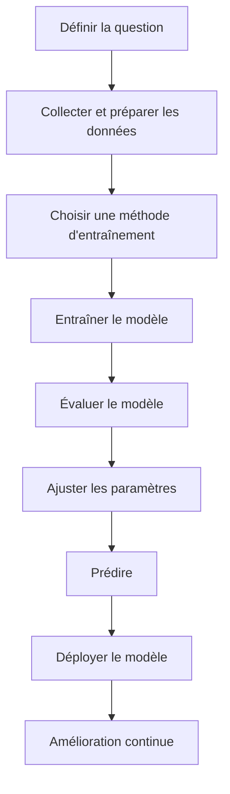

# Définition Machine Learning 

Le Machine Learning utilise des algorithmes pour analyser des données, identifier des modèles, et faire des prédictions ou des décisions basées sur ces données. L'objectif est de créer des modèles capables de généraliser à partir des exemples qu'ils ont vus pour traiter de nouvelles informations de manière autonome.

## Les différents étapes en Machine Learning

Nous allons comprendre les différents étapes à travaers un example (Prédiction des prix des maisons)

1. **Définir la question**
    - **Description** : Formuler une question complexe que l'on souhaite résoudre. Par exemple, "Comment peut-on prédire le prix de vente d'une maison en fonction de ses caractéristiques ?"
    - **Explication** : Nous voulons créer un modèle qui peut estimer le prix des maisons en se basant sur des informations telles que la taille, le nombre de chambres, ou la localisation.

2. **Collecter et préparer les données**
   - **Description** : Rassembler des données pertinentes, explorer les données, les nettoyer pour retirer les valeurs incorrectes ou manquantes, et les préparer pour l'analyse. Ensuite, diviser ces données en un ensemble d'entraînement (pour apprendre) et un ensemble de test (pour l'évaluation).
   - **Exemple** : Nous collectons des données de ventes de maisons, incluant des caractéristiques comme la superficie, le nombre de chambres, et l'emplacement, puis nous divisons ces données en 80% pour l'entraînement et 20% pour le test.

3. **Choisir une méthode d'entraînement**
    - **Description** : Sélectionner le type de modèle qui convient le mieux à la question et aux données. Cela peut inclure des modèles comme la régression linéaire, les arbres de décision, ou les réseaux de neurones.
    - **Exemple** : On choisit d'utiliser la régression linéaire, car nous souhaitons prédire un chiffre précis (le prix de la maison).

4. **Entraîner le modèle**
    - **Description** : Utiliser les données d'entraînement pour enseigner au modèle à reconnaître des schémas ou des relations entre les caractéristiques et le prix de vente.
    - **Exemple** : Le modèle apprend la relation entre les caractéristiques des maisons et les prix, ajustant ses paramètres pour minimiser l'erreur entre ses prédictions et les valeurs réelles.

5. **Évaluer le modèle**
   - **Description** : Tester le modèle sur les données de test pour voir comment il performe avec de nouvelles données qu'il n'a jamais vues auparavant.
   - **Exemple** : Nous utilisons les 20% de données réservées pour évaluer la précision du modèle, en vérifiant combien les prédictions sont proches des prix réels.

6. **Ajuster les paramètres**
    - **Description** : Modifier les hyperparamètres ou essayer différentes méthodes pour améliorer la performance du modèle.
    - **Exemple** : Si la précision est faible, on peut essayer d'ajuster la régularisation, ou même de changer complètement l'algorithme pour obtenir de meilleurs résultats.

7. **Prédire**
    - **Description** : Utiliser le modèle pour faire des prédictions avec de nouvelles données qui n'ont pas été vues auparavant.
    - **Exemple** : Le modèle est maintenant utilisé pour prédire les prix des maisons en fonction des caractéristiques fournies, et les résultats peuvent être utilisés dans des applications concrètes pour estimer les valeurs immobilières.

8. **Déployment du modèle**
    - **Description** : Après avoir obtenu un modèle performant, il est déployé pour être utilisé en production. Cela signifie que le modèle est intégré dans un système réel où il reçoit de nouvelles données et effectue des prédictions en temps réel.
    - **Exemple** : Le modèle de prédiction des prix des maisons est déployé sur une plateforme immobilière pour estimer les valeurs des maisons de manière automatique.

9. **Amélioration continue**
   - **Description** : Une fois le modèle en production, il doit être constamment surveillé pour vérifier ses performances. Les données changent avec le temps, et le modèle doit être mis à jour ou ajusté pour rester précis.
   - **Exemple** : Si les tendances du marché immobilier changent, le modèle devra être réentraîné avec de nouvelles données pour maintenir sa précision.

